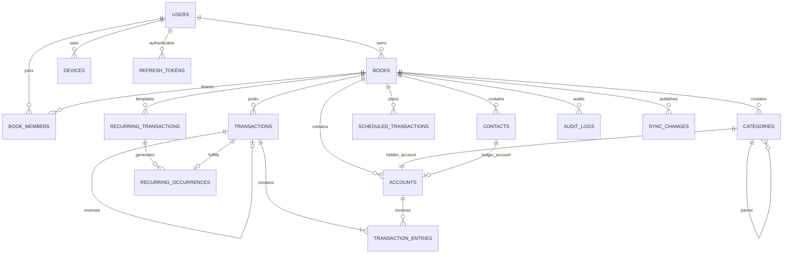

# ER diyagramı

```mermaid
erDiagram
  USERS ||--o{ BOOKS : owns
  USERS ||--o{ BOOK_MEMBERS : joins
  BOOKS ||--o{ BOOK_MEMBERS : shares
  BOOKS ||--o{ ACCOUNTS : contains
  BOOKS ||--o{ CATEGORIES : contains
  CATEGORIES ||--o{ CATEGORIES : parent
  CATEGORIES ||--|| ACCOUNTS : hidden_account
  BOOKS ||--o{ CONTACTS : contains
  CONTACTS ||--o| ACCOUNTS : ledger_account
  BOOKS ||--o{ TRANSACTIONS : posts
  TRANSACTIONS ||--|{ TRANSACTION_ENTRIES : contains
  ACCOUNTS ||--o{ TRANSACTION_ENTRIES : receives
  TRANSACTIONS ||--o| TRANSACTIONS : reverses
  BOOKS ||--o{ SCHEDULED_TRANSACTIONS : plans
  BOOKS ||--o{ RECURRING_TRANSACTIONS : templates
  RECURRING_TRANSACTIONS ||--o{ RECURRING_OCCURRENCES : generates
  TRANSACTIONS ||--o| RECURRING_OCCURRENCES : fulfills
  BOOKS ||--o{ AUDIT_LOGS : audits
  BOOKS ||--o{ SYNC_CHANGES : publishes
  USERS ||--o{ DEVICES : uses
  USERS ||--o{ REFRESH_TOKENS : authenticates
```

